# ScorecastArr — User Guide

**Version:** 0.2.0-beta  
**Last Updated:** 2026-04-15

ScorecastArr is a self-hosted live sports scoreboard that streams directly into Dispatcharr as real IPTV channels. It pulls live data from ESPN, renders a full HD scoreboard, and delivers it as an HLS video stream — automatically registering and numbering channels in Dispatcharr for you.

---

## Table of Contents

1. [How It Works](#1-how-it-works)
2. [Requirements](#2-requirements)
3. [Installation](#3-installation)
4. [Finding Your STREAM_BASE_URL](#4-finding-your-stream_base_url)
5. [The Main Scoreboard](#5-the-main-scoreboard)
6. [Settings Overview](#6-settings-overview)
7. [Integrations — Connecting Dispatcharr](#7-integrations--connecting-dispatcharr)
8. [My Scoreboards](#8-my-scoreboards)
9. [Creating & Editing a Scoreboard](#9-creating--editing-a-scoreboard)
10. [Stream Card Style](#10-stream-card-style)
11. [Default Stream Settings](#11-default-stream-settings)
12. [Sports Library](#12-sports-library)
13. [Audio Library](#13-audio-library)
14. [Ticker Overlay](#14-ticker-overlay)
15. [System Theme](#15-system-theme)
16. [Backup & Restore](#16-backup--restore)
17. [Pushing Channels to Dispatcharr](#17-pushing-channels-to-dispatcharr)
18. [Troubleshooting](#18-troubleshooting)
19. [Getting Help & Reporting Issues](#19-getting-help--reporting-issues)

---

## 1. How It Works

ScorecastArr runs four Docker containers that work together:

| Container | Role |
|-----------|------|
| `scorecastarr-api` | Fetches ESPN data, manages the database, talks to Dispatcharr |
| `scorecastarr-web` | Nginx — serves the scoreboard UI and HLS streams on port 7777 |
| `scorecastarr-stream` | Headless Chrome renderer + FFmpeg — turns the scoreboard into live video |

When you create a scoreboard, the stream manager starts a dedicated headless Chrome instance that renders the scoreboard UI. FFmpeg captures that rendered page at your configured framerate and encodes it to HLS. Dispatcharr then picks up those HLS streams as IPTV channels.

---

## 2. Requirements

| Requirement | Minimum | Recommended |
|-------------|---------|-------------|
| CPU | 2 cores | 4+ cores (1 core per active scoreboard stream) |
| RAM | 3 GB | 6 GB |
| Disk | 5 GB free | 10 GB+ (audio files add up) |
| OS | Linux (any) | Ubuntu 22.04+ |
| Docker | 24.x | Latest |
| Docker Compose | v2 | Latest |
| Dispatcharr | 0.15.0+ | Latest |

> **Note:** Headless Chrome is the most resource-intensive part. Each active scoreboard stream runs its own Chrome instance. The `shm_size: 512mb` on the stream container is required — Chrome will crash without it.

---

## 3. Installation

### Step 1 — Create a folder on your server

```bash
mkdir ~/scorecastarr && cd ~/scorecastarr
```

### Step 2 — Create your `docker-compose.yml`

Create a file called `docker-compose.yml` with the following contents:

```yaml
services:
  scorecastarr-api:
    image: ghcr.io/jstevenscl/scorecastarr-api:beta
    container_name: scorecastarr-api
    restart: unless-stopped
    environment:
      - TZ=America/New_York
      - STREAM_BASE_URL=http://172.19.0.1:7777
      - STREAM_MANAGER_URL=http://scorecastarr-stream:3001
      - DISPATCHARR_URL=http://10.0.0.40:9191
      - DB_PATH=/config/scorecastarr.db
    volumes:
      - scorecastarr_config:/config
      - scorecastarr_audio:/audio_library
    networks:
      - scorecastarr_net

  scorecastarr-web:
    image: ghcr.io/jstevenscl/scorecastarr-web:beta
    container_name: scorecastarr-web
    restart: unless-stopped
    ports:
      - "7777:80"
    volumes:
      - scorecastarr_hls:/usr/share/nginx/html/hls:ro
    networks:
      - scorecastarr_net

  scorecastarr-stream:
    image: ghcr.io/jstevenscl/scorecastarr-stream:beta
    container_name: scorecastarr-stream
    restart: unless-stopped
    environment:
      - TZ=America/New_York
      - STREAM_WIDTH=1920
      - STREAM_HEIGHT=1080
      - STREAM_FPS=1
      - STREAM_QUALITY=balanced
      - WEB_BASE=http://scorecastarr-web
      - DB_PATH=/config/scorecastarr.db
      - HLS_DIR=/hls
      - PIPES_DIR=/tmp/pipes
      - MANAGER_PORT=3001
      - HLS_SEGMENT_DURATION=2
      - HLS_PLAYLIST_SIZE=4
      - AUDIO_DIR=/audio_library
    volumes:
      - scorecastarr_config:/config
      - scorecastarr_hls:/hls
      - scorecastarr_audio:/audio_library
      - scorecastarr_ticker:/ticker
    networks:
      - scorecastarr_net
    shm_size: 512mb

networks:
  scorecastarr_net:
    name: scorecastarr_net
    driver: bridge

volumes:
  scorecastarr_config:
    name: scorecastarr_config
  scorecastarr_hls:
    name: scorecastarr_hls
  scorecastarr_audio:
    name: scorecastarr_audio
  scorecastarr_ticker:
    external: true
```

### Key environment variables explained

| Variable | Description |
|----------|-------------|
| `TZ` | Your timezone. Controls how game times display on the scoreboard. |
| `STREAM_BASE_URL` | The URL Dispatcharr uses to reach your HLS streams. **See Section 4 — this is the most important setting to get right.** |
| `STREAM_MANAGER_URL` | Internal address of the stream container. Leave as `http://scorecastarr-stream:3001`. |
| `DISPATCHARR_URL` | Your Dispatcharr instance URL. |
| `DB_PATH` | Path inside the container where the database is stored. Leave as-is. |
| `STREAM_WIDTH` / `STREAM_HEIGHT` | Resolution of the output video stream (1920×1080 recommended). |
| `STREAM_FPS` | Frames per second. `1` is ideal for a scoreboard — it changes infrequently and low FPS dramatically reduces CPU load. |
| `STREAM_QUALITY` | Encoding quality preset: `fast`, `balanced`, or `quality`. |
| `HLS_SEGMENT_DURATION` | Length of each HLS chunk in seconds. Lower = less latency. |
| `HLS_PLAYLIST_SIZE` | Number of HLS segments kept in the playlist. |

### Step 3 — Create the ticker volume (required before first start)

The ticker volume must be created before starting the stack:

```bash
docker volume create scorecastarr_ticker
```

### Step 4 — Start the stack

```bash
docker compose up -d
```

### Step 5 — Verify it's running

```bash
docker logs scorecastarr-api --tail 30
docker logs scorecastarr-stream --tail 30
```

You should see the API start up and the stream manager come online. Once both are healthy, open your browser to:

```
http://YOUR_SERVER_IP:7777
```

---

## 4. Finding Your STREAM_BASE_URL

This is the single most common setup issue. The `STREAM_BASE_URL` is the URL that **Dispatcharr's container** uses to reach ScorecastArr's HLS streams. It cannot be `localhost` or a container name because Dispatcharr runs in its own Docker network.

### Scenario A — Same host machine, different Docker stacks

If ScorecastArr and Dispatcharr are both on the same physical server but in separate Docker stacks (the most common setup), use the **Docker bridge gateway IP**:

```bash
# After starting your stack, run:
docker network inspect scorecastarr_net | grep Gateway
```

You'll see output like:
```
"Gateway": "172.19.0.1"
```

Your `STREAM_BASE_URL` would then be:
```
STREAM_BASE_URL=http://172.19.0.1:7777
```

### Scenario B — Different machines

If ScorecastArr runs on a different server than Dispatcharr, use the **LAN IP of the ScorecastArr server**:

```
STREAM_BASE_URL=http://192.168.1.50:7777
```

### Scenario C — Same Docker stack

If you add ScorecastArr directly to the same Docker Compose file as Dispatcharr, use the container name:

```
STREAM_BASE_URL=http://scorecastarr-web:80
```

> **After changing `STREAM_BASE_URL`**, restart the API container to apply it:
> ```bash
> docker restart scorecastarr-api
> ```

---

## 5. The Main Scoreboard

Once the containers are running, navigate to `http://YOUR_SERVER_IP:7777` to see the main scoreboard.

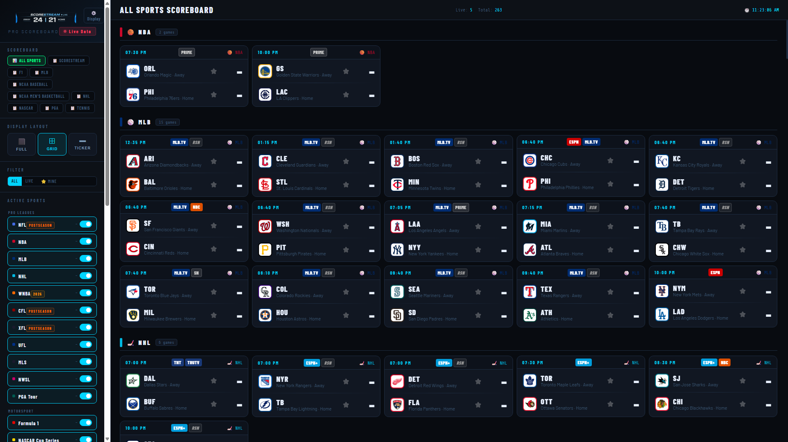

### Layout

**Left sidebar** — Shows all active sports sections. Click any sport name to jump to that section. Toggle sports on/off for the current view using the toggles next to each label.

**Main area** — The live scoreboard grid. Each card represents one game: live scores, team logos, period/inning, and game status (Live, Final, Scheduled). Scores that change are briefly highlighted.

**Top bar** — Shows the scoreboard name, current date/time, and a connection status indicator.

### Sidebar controls

| Control | Function |
|---------|----------|
| Sport toggles | Show/hide each sport's section in the current view |
| **CPU Saver** button | Pauses the video stream encoding to save CPU when not in use. The scoreboard data still refreshes — only the video output pauses. |
| **Stream Mode** button | Hides all UI chrome (sidebar, topbar) and shows only the raw scoreboard grid — this is what gets captured for the HLS stream. |
| **⚙️ Settings** button | Opens the Settings panel |

### Understanding game cards

Each game card shows:
- Team logos and abbreviations
- Current score (or scheduled time for upcoming games)
- Game status: **LIVE** (with period/quarter/inning), **FINAL**, or a start time
- A yellow highlight briefly appears on scores when they update

---

## 6. Settings Overview

Click the **⚙️ Settings** button in the sidebar (or click the Dispatcharr status badge at the top of the sidebar) to open Settings.

The Settings panel has a left navigation with these sections:

| Section | Purpose |
|---------|---------|
| **My Scoreboards** | Create, edit, and manage your scoreboard channels |
| **Stream Card Style** | Global card appearance (applies to all scoreboards by default) |
| **Default Stream Settings** | Default display settings new scoreboards inherit |
| **System Theme** | UI colors and font scaling |
| **Sports Library** | Enable/disable sports globally |
| **Audio Library** | Upload music tracks and create playlists |
| **Ticker Overlay** | Configure the score ticker crawl for HLS streams |
| **Integrations** | Dispatcharr connection and channel management |
| **Backup & Restore** | Export/import your full configuration |

---

## 7. Integrations — Connecting Dispatcharr

Before you can push channels to Dispatcharr, you need to enter your credentials.

Go to **Settings → Integrations**.

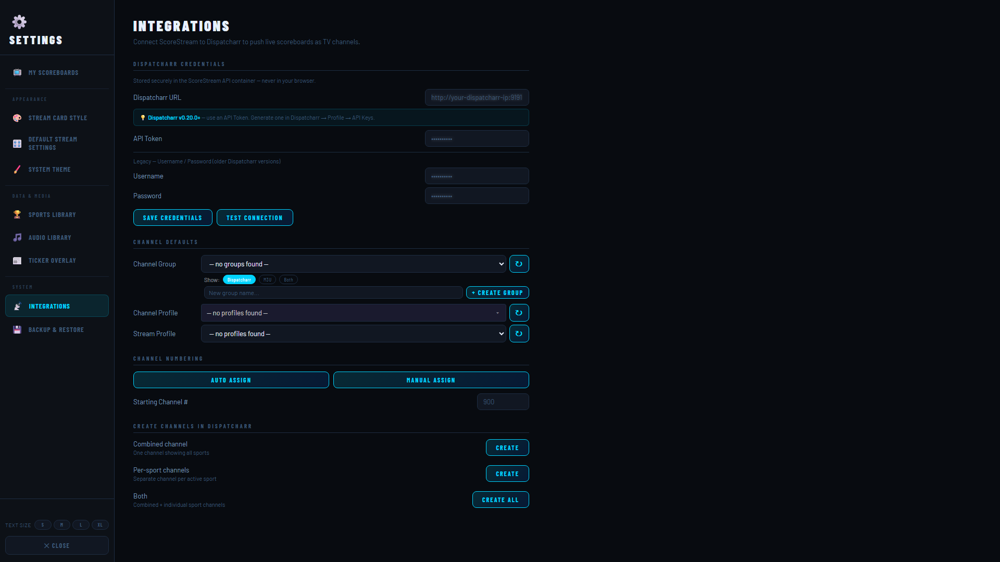

### Dispatcharr Credentials

1. Enter your **Dispatcharr URL** (e.g. `http://10.0.0.40:9191`)
2. Enter your Dispatcharr **username** and **password**
3. Click **Save Credentials**
4. Click **Test Connection** — you should see a green success message

If the test fails:
- Confirm Dispatcharr is running and reachable from your ScorecastArr server
- Try the URL in a browser to verify it loads
- Check that your username and password are correct

### Channel Settings

After connecting, configure how ScorecastArr creates channels in Dispatcharr:

**Channel Group** — The group name ScorecastArr channels will be placed in within Dispatcharr. Default is `ScorecastArr`. You can type a custom name or select an existing group from the dropdown.

**Channel Profile** — Which Dispatcharr channel profile(s) to assign your streams to. Use the dropdown to select a profile, or leave blank to add to all profiles.

**Starting Channel Number** — The first channel number to use when auto-numbering. ScorecastArr will assign sequential numbers starting from this value.

### Manual Channel Actions

At the bottom of the Integrations page:

| Button | Action |
|--------|--------|
| **Auto Assign** | Automatically renumber all ScorecastArr channels sequentially |
| **Force Sync** | Re-push all channel metadata to Dispatcharr (useful after URL or name changes) |
| **Create Group** | Manually create the channel group in Dispatcharr |
| **Create Profile** | Manually create a channel profile |

---

## 8. My Scoreboards

Go to **Settings → My Scoreboards**.


A **Scoreboard** is one HLS video stream channel. Each scoreboard:
- Shows only the sports/leagues you choose
- Can optionally filter to specific teams
- Has its own display settings (colors, fonts, card layout)
- Has its own audio track or playlist
- Gets pushed to Dispatcharr as a separate IPTV channel

### Scoreboard card actions

Each scoreboard card shows:
- **Name** and how many sports are enabled
- **Stream status** — 🔴 Streaming (video encoding is active) or paused
- **Dispatcharr status** — whether it has been pushed and registered

| Button | Action |
|--------|--------|
| **Edit** | Open the editor to change sports, teams, and display settings |
| **Duplicate** | Create a copy of this scoreboard |
| **📤 Export JSON** | Download this scoreboard's config as a JSON file |
| **📡 Push to Dispatcharr** | Register this scoreboard as a channel in Dispatcharr |
| **DELETE** | Permanently remove the scoreboard and its channel |

### Creating a new scoreboard

Click **+ New Scoreboard** at the bottom of the My Scoreboards page. You can also click **📥 Import from JSON** to restore a previously exported scoreboard.

---

## 9. Creating & Editing a Scoreboard

The scoreboard editor has three steps: **Sports**, **Teams**, and **Display & Save**.

### Step 1 — Sports

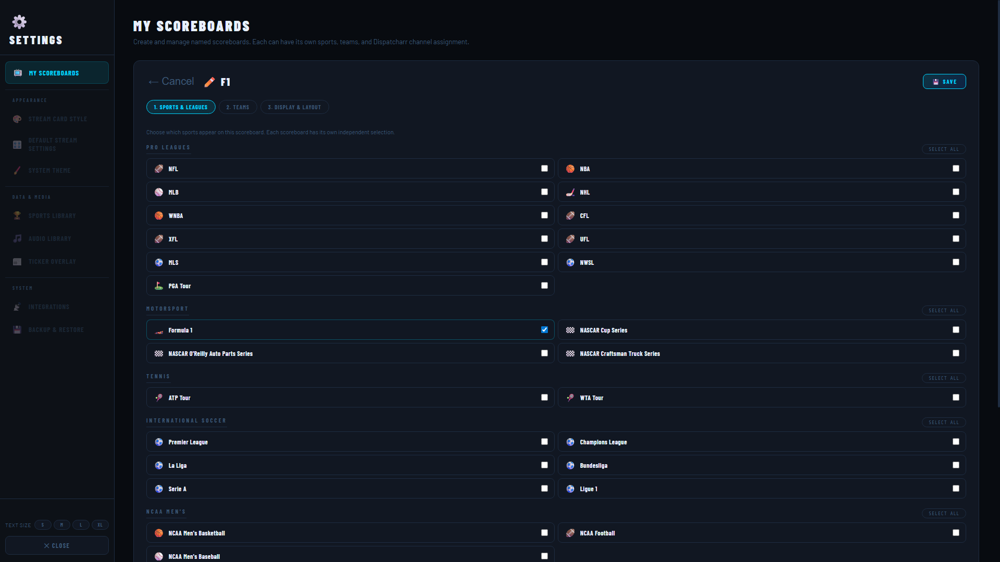

Select which sports and leagues this scoreboard will display. Everything shown here is what the Sports Library has enabled globally (see [Section 12](#12-sports-library)).

- Toggle any sport or league on/off using the checkboxes
- You can mix and match — a single scoreboard can show NFL + NBA + NHL together, or just one sport
- Motorsports like F1 and NASCAR appear in the Motorsports section at the bottom

Click **Next →** when done.

### Step 2 — Teams

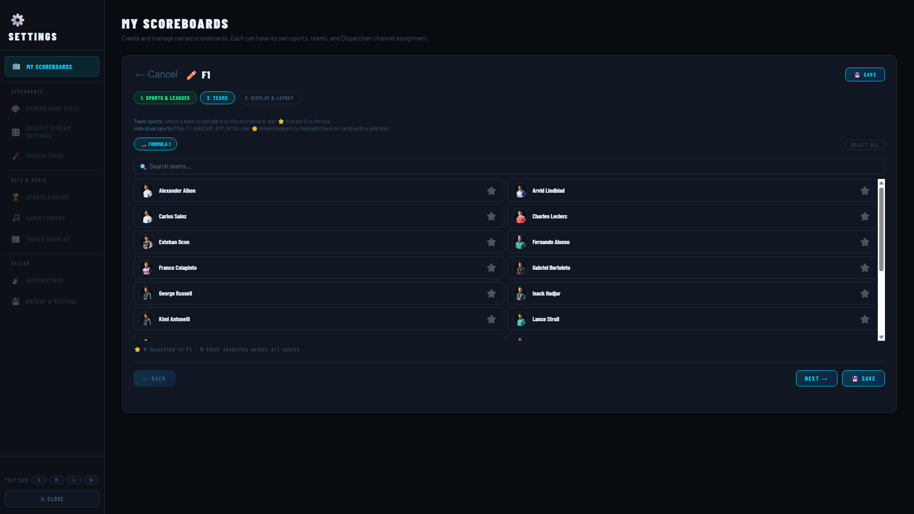

Optionally filter which teams appear on this scoreboard.

- **All** (default) — shows all games for the sports you selected
- Toggle individual teams off to exclude their games from this scoreboard

This is useful for creating a dedicated scoreboard for your favourite team — e.g. a scoreboard that only shows Chicago Bulls games within the NBA section.

> **Motorsports note:** For F1 and NASCAR, Step 2 shows **drivers** instead of teams. Toggle individual drivers on/off to filter whose results appear on the scoreboard.

If you leave all selections on, every game/race for every selected sport will appear. Click **Next →** when done.

### Step 3 — Display Settings

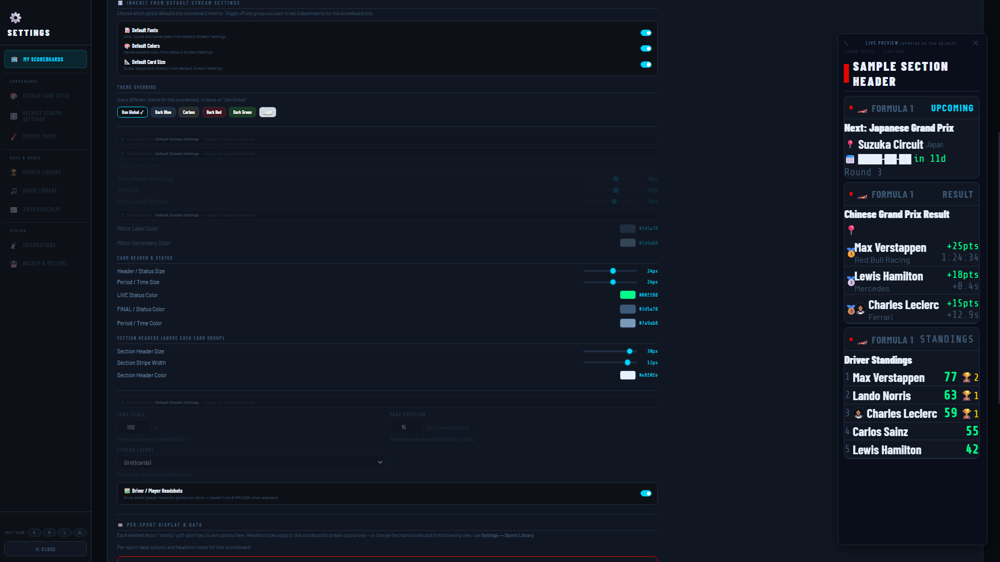

The **Sample Section Header** preview panel on the right updates live as you change settings.

#### Scoreboard Name
The display name for this scoreboard. This name appears in Dispatcharr as the channel name.

#### Inherit from Default
When this link is active, the scoreboard uses the global defaults from **Default Stream Settings**. Click it to break inheritance and set custom values for just this scoreboard.

#### Font
Choose the font used for team names, scores, and labels on this scoreboard's cards.

#### Color
The accent color for this scoreboard — used for score highlights, live indicators, and header accents. Click the color swatch to open a color picker.

#### Resolution
The video resolution for this scoreboard's stream. Defaults to 960×1080 (half-width, full-height) which is efficient for a sidebar-style scoreboard. Full 1920×1080 is also available.

#### Show Inline options

| Toggle | Effect |
|--------|--------|
| **Inline Fonts** | Show/hide team name text labels on game cards |
| **Inline Icons** | Show/hide team logo icons on game cards |
| **Inline Card Divi** | Show/hide the divider line between game cards |

#### Ticker

Controls whether a score ticker crawl appears at the bottom of this scoreboard's video stream:

| Option | Effect |
|--------|--------|
| **No ticker** | No crawl bar — clean full scoreboard only |
| **Set idle** | Ticker only appears when the scoreboard has no live games |
| **Sol** | Ticker always shows (scrolling score crawl alongside the scoreboard) |

> The Ticker Overlay must be configured in **Settings → Ticker Overlay** before this option has an effect. See [Section 14](#14-ticker-overlay).

#### Card Transparency
Adjusts how transparent/opaque the game cards are. Slide left for more transparent, right for fully solid.

#### Show Today's Date
Toggle on to display the current date in the scoreboard header bar.

#### Driver / Player Status Size
(Motorsport and certain sports only) — Controls the font size of driver standings entries in the scoreboard section.

---

### Step 3 — Audio

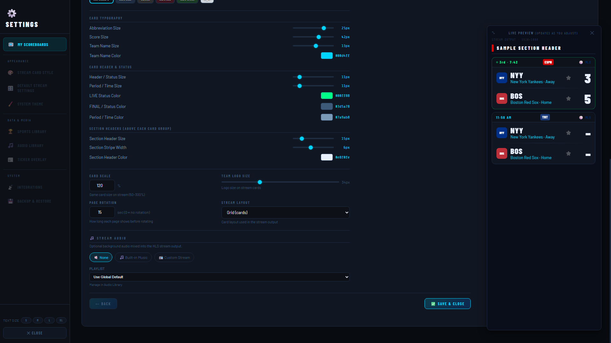

Scroll down in Step 3 to reach the Audio section.

#### Stream Audio toggle
Enables audio on this scoreboard's HLS stream. When off, the stream is silent.

#### Audio Mode

| Mode | Description |
|------|-------------|
| **None** | No audio |
| **Stream** | Play audio from a live URL (internet radio, another HLS stream, etc.) |
| **Playlist** | Play tracks from a playlist you've created in the Audio Library |

#### Stream mode — Custom URL
Enter any publicly accessible audio stream URL (e.g. an internet radio station's stream URL). ScorecastArr will pull the audio and mix it into the HLS output.

#### Playlist mode
Select a playlist you've created in the Audio Library. Tracks play in order and loop. You can see the available playlists listed in the dropdown.

Click **💾 Save & Exit** to save the scoreboard and return to My Scoreboards.

---

## 10. Stream Card Style

Go to **Settings → Stream Card Style**.

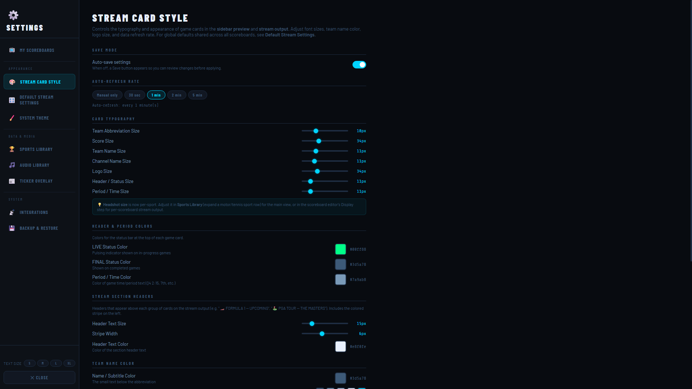

These settings control the visual appearance of game cards **globally** — across all scoreboards that haven't overridden them individually.

### Dark/Light/Preference mode
Toggle between dark, light, or system-preference card themes.

### Card typography sliders

| Slider | Controls |
|--------|---------|
| **Team Abbreviation Size** | Font size of team abbreviations (e.g. NYY, LAD) |
| **Score Size** | Font size of the score numbers |
| **Count Size** | Font size of count/period/inning info |
| **Logo Size** | Size of team logo icons on cards |
| **Header / Timer Size** | Font size of section headers and game clocks |
| **Period / Time Size** | Font size of period and time-remaining text |

### Score & status colors
Set the colors used for:
- **Live Status** — color of the LIVE badge on in-progress games
- **Final Status** — color of the FINAL badge on completed games

### Section headers
Control the size and color of the sport section header bars that separate sports on the scoreboard.

Changes here apply to all scoreboards that use the default style. To override for a specific scoreboard, edit that scoreboard in Step 3.

---

## 11. Default Stream Settings

Go to **Settings → Default Stream Settings**.

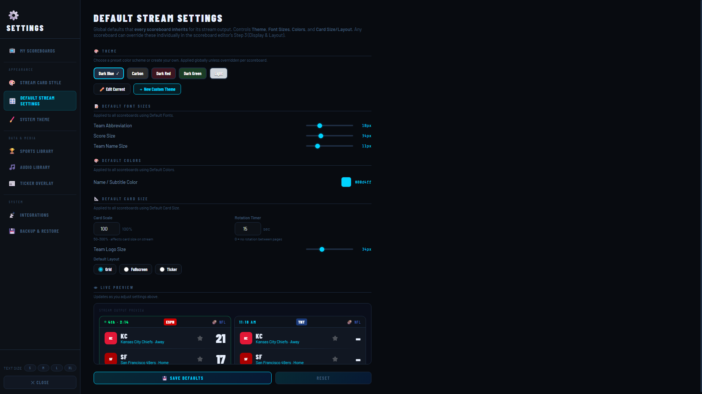

These are the baseline display settings that new scoreboards inherit. When you create a new scoreboard, it starts with these values. If you later change the defaults, scoreboards that are still set to "Inherit from Default" will update automatically.

### Scoreboard presets

At the top, several quick-apply presets are available — click one to apply a complete style package (font + color combination) as your new default.

### Settings

All the same display options as in the per-scoreboard editor (Step 3) are available here as defaults:
- Default font
- Default accent color
- Default resolution
- Default Inline Fonts/Icons/Card Divider toggles
- Default ticker mode
- Default card transparency

A live preview at the bottom shows how cards will look with your current default settings.

---

## 12. Sports Library

Go to **Settings → Sports Library**.

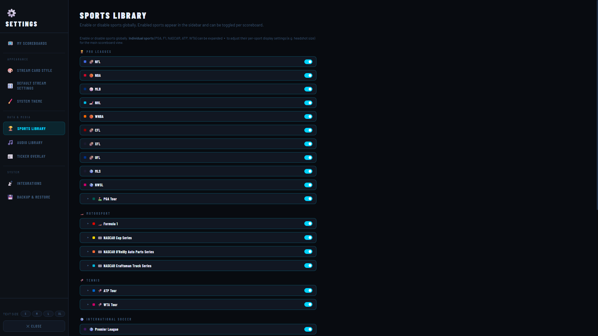

The Sports Library is the master on/off switch for every sport and league available in ScorecastArr. **If a sport is disabled here, it will not appear in any scoreboard editor and cannot be added to any scoreboard.**

### How to use it

- Toggle any sport or league **on** to make it available across the app
- Toggle it **off** to completely hide it from all scoreboards and the main scoreboard sidebar
- Changes take effect immediately — no restart needed

### Organization

Sports are grouped by category:
- **Pro Leagues** — NFL, NBA, MLB, NHL, MLS, etc.
- **Motorsports** — Formula 1, NASCAR Cup Series, IndyCar, etc.
- **College Sports** — NCAAB, NCAAF, NCAA Baseball, etc.
- **International** — Premier League, Champions League, Liga MX, etc.
- **Other** — Tennis ATP/WTA, PGA Tour, WNBA, etc.

> **Tip:** Disable sports you never watch to keep the scoreboard and editors clean. You can always re-enable them later.

---

## 13. Audio Library

Go to **Settings → Audio Library**.

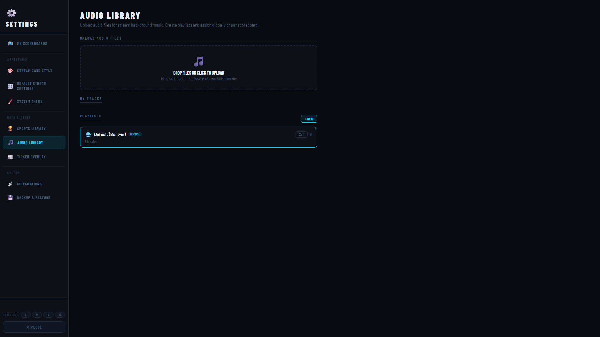

The Audio Library is where you upload music tracks and organize them into playlists that scoreboards can play.

### Uploading tracks

Drag and drop audio files directly onto the **"Drop files here to upload"** area, or click it to browse. Supported formats: MP3, AAC, FLAC, OGG, WAV.

Files upload to the `scorecastarr_audio` Docker volume, so they persist across container restarts and updates.

### Track list

All uploaded tracks appear in the list below the upload area. Each track shows its filename and has:
- **▶ Play** — Preview the track in your browser
- **🗑 Delete** — Remove the track permanently

### Playlists

Playlists group tracks for assignment to scoreboards. By default, a **Default (Built-in)** playlist exists using the built-in background audio.

#### Creating a playlist

1. Click **+ Add Playlist** at the bottom of the page
2. Give the playlist a name (e.g. "F1 Race Music", "Baseball Chill")
3. Add tracks to it by dragging them from the track list into the playlist, or by clicking **+ Add Track** inside the playlist
4. Reorder tracks by dragging them within the playlist

#### Assigning a playlist to a scoreboard

In the scoreboard editor (Step 3 → Audio section), set the mode to **Playlist** and select your playlist from the dropdown.

---

## 14. Ticker Overlay

Go to **Settings → Ticker Overlay**.

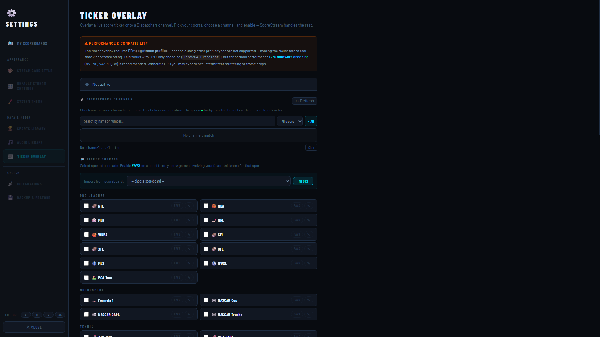

The Ticker Overlay adds a scrolling score crawl bar to the bottom of your HLS streams — similar to what you see on ESPN or NFL Network. The ticker shows live scores from all selected sports, scrolling continuously.

> **Performance note:** The ticker feature increases CPU usage because it requires compositing an additional overlay onto the video stream. Review the performance warning shown at the top of this page before enabling it.

### Dispatcher Channel

The Dispatcharr channel that will carry the ticker-enhanced stream. Select from your existing ScorecastArr channels in the dropdown.

### Preview Channel

An optional secondary channel that shows only the ticker bar (without the full scoreboard) — useful for testing the layout before pushing it live.

### Source Channel

The underlying scoreboard stream that the ticker reads scores from.

### Sport channels

The grid of checkboxes at the bottom lets you choose which sports feed into the ticker crawl. Enable only the sports you want to appear in the scrolling ticker.

---

## 15. System Theme

Go to **Settings → System Theme**.

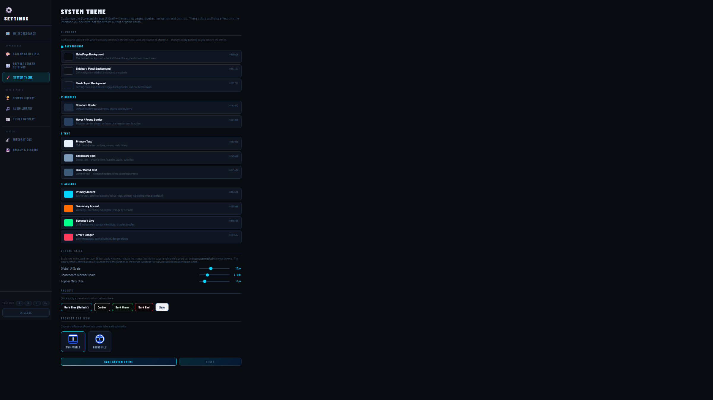

System Theme controls the overall color palette of the ScorecastArr UI — both the settings interface and the main scoreboard view.

### Color slots

| Slot | Controls |
|------|---------|
| **Main Page Background** | The background behind the scoreboard grid |
| **Canvas Page Background** | The background visible around score cards |
| **Background / Panels** | Sidebar and settings panel backgrounds |
| **Scoreboard Accent** | Primary highlight color (cyan/teal by default) |
| **Secondary Text** | Dimmed label text color |
| **Ticker Color** | Ticker bar background color |
| **Error / Change** | Score-change highlight and error indicator color |

Click any color swatch to open a color picker. Changes apply immediately.

### UI Scale

Two scale sliders control how large the interface renders:

**Global UI Scale** — Scales the entire settings UI, navigation, and sidebar. Use this if ScorecastArr looks too small or too large on your display.

**Scoreboard Sidebar Scale** — Applies additional zoom to just the main scoreboard's left sidebar (sport toggles and labels). Stacks on top of the global scale.

---

## 16. Backup & Restore

Go to **Settings → Backup & Restore**.

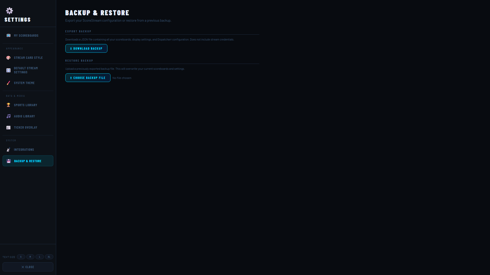

### Creating a backup

Click **Download Backup** to export your entire ScorecastArr configuration as a JSON file. This includes:
- All scoreboard definitions (sports, teams, display settings, audio assignments)
- Integrations settings (Dispatcharr URL, channel group, channel numbering)
- Sports Library enable/disable state
- System Theme colors

> **Note:** The backup does **not** include uploaded audio files (those are in the Docker volume). Back up the `scorecastarr_audio` volume separately if needed.

### Restoring from a backup

Click **Choose Backup File**, select a previously downloaded backup JSON, and click **Restore**. Your current configuration will be replaced with the backup.

---

## 17. Pushing Channels to Dispatcharr

Once your Dispatcharr credentials are saved and tested (Section 7), you can push any scoreboard to Dispatcharr as an IPTV channel.

### Step 1 — Verify Integrations are configured

Go to **Settings → Integrations** and confirm the Dispatcharr connection shows a green status.

### Step 2 — Push a scoreboard

Go to **Settings → My Scoreboards**. On any scoreboard card, click **📡 Push to Dispatcharr**.

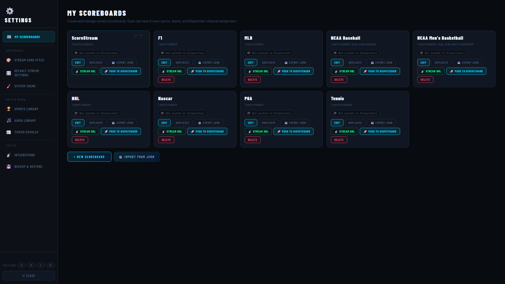

ScorecastArr will:
1. Create the channel group in Dispatcharr (if it doesn't exist)
2. Create or update the channel with the scoreboard's name
3. Assign the channel to the configured channel profile(s)
4. Set the channel's stream URL to `STREAM_BASE_URL/hls/{scoreboard-id}/stream.m3u8`

After a successful push, the scoreboard card shows **✅ Pushed to Dispatcharr** with the assigned channel number.

### Step 3 — Verify in Dispatcharr

Open Dispatcharr and go to **Channels**. Filter by your ScorecastArr group (default: "ScorecastArr"). Your scoreboard should appear with an HLS stream URL assigned. Click the preview icon to confirm video is playing.

### Re-pushing after changes

If you rename a scoreboard or change the `STREAM_BASE_URL`, push again from the scoreboard card. ScorecastArr will update the existing channel rather than create a duplicate.

### Pushing all scoreboards at once

Go to **Settings → Integrations** and click **Force Sync** to push all scoreboards to Dispatcharr in one operation.

---

## 18. Troubleshooting

### Scoreboard shows a blank page / "ScorecastArr" with no games

**Cause:** The container is still starting up, or the API can't reach ESPN's data endpoints.

```bash
docker logs scorecastarr-api --tail 50
```

Wait 30–60 seconds after first start for data to load. ESPN data refreshes every 60 seconds.

### Dispatcharr shows the channel but video won't play

**Cause:** `STREAM_BASE_URL` is incorrect — Dispatcharr can't reach the HLS stream.

1. Find your correct gateway IP:
   ```bash
   docker network inspect scorecastarr_net | grep Gateway
   ```
2. Update `STREAM_BASE_URL` in your `docker-compose.yml` to use that IP on port 7777
3. Restart the API:
   ```bash
   docker restart scorecastarr-api
   ```
4. Re-push the affected scoreboard from My Scoreboards

### "Test Connection" fails in Integrations

1. Verify Dispatcharr is running:
   ```bash
   curl http://10.0.0.40:9191/api/v2/health/
   ```
2. Test from inside the ScorecastArr container:
   ```bash
   docker exec scorecastarr-api wget -qO- http://10.0.0.40:9191/api/token/
   ```
   A `405 Method Not Allowed` response means the connection works — that's expected for a GET on that endpoint.
3. Check for typos in the URL (no trailing slash required)

### Stream container keeps restarting

```bash
docker logs scorecastarr-stream --tail 50
```

Common causes:
- `shm_size: 512mb` is missing from the compose file — Chrome needs shared memory
- `scorecastarr-web` isn't healthy yet — the stream container depends on it
- Not enough RAM — Chrome requires at least 512 MB per instance

### Audio not playing on a scoreboard stream

1. Confirm **Stream Audio** is toggled on in the scoreboard editor (Step 3 → Audio)
2. If using **Stream mode**: verify the URL is a direct audio stream, not a website
3. If using **Playlist mode**: confirm the playlist has at least one track in the Audio Library
4. Check logs:
   ```bash
   docker logs scorecastarr-stream --tail 50 | grep -i audio
   ```

### Ticker is not appearing on the stream

1. Go to **Settings → Ticker Overlay** and confirm at least one sport is checked
2. Confirm the scoreboard's ticker mode (Step 3 → Ticker) is set to **Sol** or **Set idle**
3. The ticker requires a Dispatcher channel to be selected in Ticker settings

### Channel numbers are wrong after re-pushing

Go to **Settings → Integrations** and click **Auto Assign** to renumber all ScorecastArr channels sequentially from your configured starting number.

### Updating ScorecastArr

```bash
# Pull the latest images
docker compose pull

# Restart with new images
docker compose up -d

# Check versions
docker logs scorecastarr-api 2>&1 | grep -i "version\|starting"
```

Your configuration (scoreboards, audio playlists, settings) is stored in the `scorecastarr_config` volume and survives updates.

---

## 19. Getting Help & Reporting Issues

If something isn't working or you have a question, the fastest paths to an answer are:

### Check the troubleshooting section first

Section 18 covers the most common problems. Read through it before opening an issue — many problems are already documented with a fix.

### Search existing GitHub Issues

Someone may have already reported your bug or asked your question. Browse [open and closed issues](https://github.com/jstevenscl/scorecastarr/issues?q=is%3Aissue) before creating a new one.

### Open a GitHub Issue

Go to the [Issues page](https://github.com/jstevenscl/scorecastarr/issues/new/choose) and pick the template that fits:

| Template | Use when... |
|---|---|
| **Bug Report** | Something isn't working correctly — stream won't play, settings don't save, UI is broken, etc. |
| **Feature Request** | You want something added or improved that doesn't exist yet |
| **Question / Support** | You're not sure if something is a bug, or you need help with setup or configuration |

#### Tips for a useful bug report

- **Include your ScorecastArr version.** Found at the bottom of the scoreboard sidebar, or run: `docker logs scorecastarr-api 2>&1 \| grep -i version`
- **Include relevant logs.** Run `docker logs scorecastarr-api --tail 50` (or `scorecastarr-stream` / `scorecastarr-web` depending on the symptom) and paste the output.
- **Include your docker-compose.yml** (redact passwords and tokens with `****`). Many problems come from networking or volume configuration.
- **Describe what you expected vs. what actually happened.** "It doesn't work" is hard to act on — "The Push to Dispatcharr button shows success but no channel appears in Dispatcharr" is much easier to investigate.

---

*ScorecastArr — ESPN Data*
